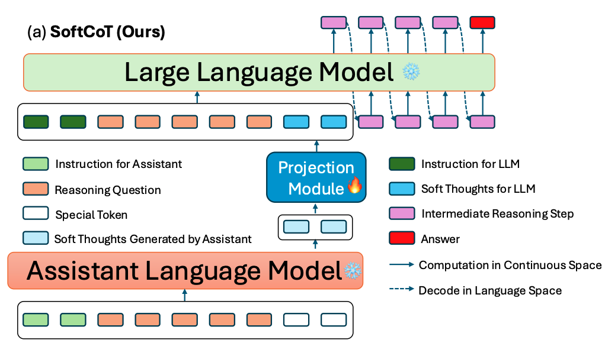
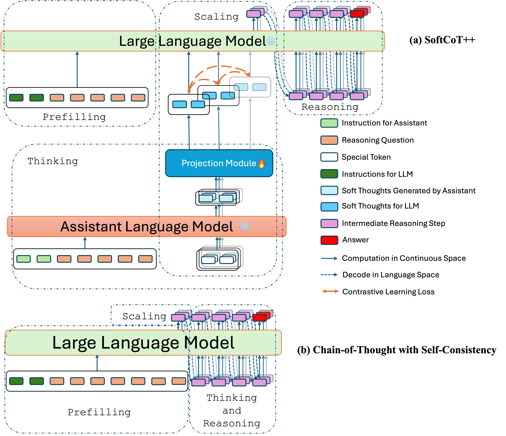

<div align="center">
<h1>SoftCoT: Soft Chain-of-Thought for Efficient Reasoning with LLMs</h1> 
</div>

<p align="center">
<a href="https://arxiv.org/abs/2502.12134">
  </a>
<a href="https://arxiv.org/abs/2505.11484">
  </a>
<br>
<b>Authors:</b>
<a href="https://xuyige.github.io">Yige Xu</a>,
<a href="https://guoxuxu.github.io/">Xu Guo</a>,
<a href="https://scholar.google.com/citations?user=6eiLXmcAAAAJ">Zhiwei Zeng</a>,
<a href="https://scholar.google.com/citations?user=fmXGRJgAAAAJ">Chunyan Miao</a>.
</p>

## Updates

- 27-May-2025: We release the camera-ready version of SoftCoT [[Paper]](https://arxiv.org/abs/2502.12134v2).
- 19-May-2025: We release the official implementation of SoftCoT++.
- 17-May-2025: To help reproducing, we release some useful data as well as an official reproduce of SoftCoT, check the data [here](https://huggingface.co/datasets/xuyige/ASDiv-Aug), check the logs and checkpoints [here](https://drive.google.com/file/d/1rC8x0dFv2oCEg_dCBOqd0lzGUwoNdLCY/view?usp=drive_link).
- 16-May-2025: We release the paper of SoftCoT++ [[Paper]](https://arxiv.org/abs/2505.11484). 
- 15-May-2025: Our SoftCoT is accepted by ACL'2025 (main conference).
- 26-Mar-2025: We release the official implementation of SoftCoT.
- 17-Feb-2025: We release the preprint version of our first SoftCoT [[Paper]](https://arxiv.org/abs/2502.12134v1).


## Overview

### SoftCoT

*How can we apply CoT in continuous space with LLMs?* —— We say **SoftCoT**!

We introduce ***SoftCoT***, a simple yet effective approach that enables LLMs to perform reasoning in continuous space while simultaneously mitigating the issue of catastrophic forgetting.

SoftCoT operates by first employing a lightweight assistant language model to generate soft thoughts—intermediate representations that capture nuanced reasoning patterns. These soft thoughts are then projected into the embedding space of the target LLM via a dedicated projection module. This process not only supports reasoning in a continuous latent space but also preserves previously learned knowledge, thereby enhancing the robustness and adaptability of the LLM.


### SoftCoT++

*How can we scale thinking in continuous space with LLMs?* —— We say **SoftCoT++**!

Unlike discrete decoding, where repeated sampling enables exploring diverse reasoning paths, latent representations in continuous space are fixed for a given input, which limits diverse exploration. To tackle this limitation, we introduce SoftCoT++, an extended version of SoftCoT, to apply test-time scaling for thinking on continuous space. Specifically, we perturb latent thoughts via multiple specialized initial tokens and apply contrastive learning to promote diversity among soft thought representations




## Quick Start

### Setup and Dependencies

Requirements for SoftCoT:

- fastNLP==0.7.0
- torch==2.4.1
- transformers==4.44.2

Requirements for SoftCoT++ (can also be used for SoftCoT):

- fastNLP==0.7.0
- torch==2.7.0
- transformers==4.51.0

### Prepare Data

Take math reasoning as example, we need to preprocess the data under the GSM8K-style, which is shown in ```./data/gsm8k```.

For better reproducing SoftCoT, you can find some useful data as well as checkpoints [here](https://drive.google.com/drive/folders/1FE1q3x9x_22P7WYpwmHflHC55sUfL3w9?usp=drive_link).

### Training 
#### Train for SoftCoT

Here we use GSM8K as an example, for Llama, we have:

```bash
CUDA_VISIBLE_DEVICES=0 python train_softcot.py \
    --large_model_id meta-llama/Llama-3.1-8B-Instruct \
    --small_model_id meta-llama/Llama-3.2-1B-Instruct \
    --output_name [Output Name] \
    --batch_size 4 \
    --task_name gsm8k \
    --num_thought_tokens 32 \
    --n_epochs 10 \
```

For Qwen, we have:

```bash
CUDA_VISIBLE_DEVICES=0 python train_softcot.py \
    --large_model_id Qwen/Qwen2.5-7B-Instruct \
    --small_model_id Qwen/Qwen2.5-1.5B-Instruct \
    --output_name [Output Name] \
    --batch_size 4 \
    --task_name gsm8k \
    --num_thought_tokens 32 \
    --n_epochs 10 \
```

**Tips**:
- The ```output_name``` argument is used to differentiate between various experimental settings.
- The training script is under the single-GPU style, we do not adopt our code to multi-GPU training.
- The argument ```num_thought_tokens``` is set to 32 during training for a more stable training. For evaluation, ```num_thought_tokens``` keeps to 4.

#### Train for SoftCoT++

Here we use GSM8K as an example, for Llama, we have:

```bash
CUDA_VISIBLE_DEVICES=0 python train_softcotpp.py \
    --large_model_id meta-llama/Llama-3.1-8B-Instruct \
    --small_model_id meta-llama/Llama-3.2-1B-Instruct \
    --output_name [Output Name] \
    --batch_size 4 \
    --model_name scaling-nce \
    --task_name gsm8k \
    --num_thought_tokens 32 \
    --num_scaling_times 10 \
    --n_epochs 10 \
```

For Qwen, we have:

```bash
CUDA_VISIBLE_DEVICES=0 python train_softcotpp.py \
    --large_model_id Qwen/Qwen3-8B \
    --small_model_id Qwen/Qwen3-0.6B \
    --output_name [Output Name] \
    --batch_size 4 \
    --model_name scaling-nce \
    --task_name gsm8k \
    --num_thought_tokens 32 \
    --num_scaling_times 10 \
    --n_epochs 10 \
```

**Tips**:
- ```num_scaling_times``` shows how many thinking chains we want to scale.
- ```model_name``` controls using Contrastive Learning Loss (```scaling-nce```) or not (```scaling```).

### Evaluation

After the training stage, we will save to projection module, which can be used for evaluation.

#### Evaluation for SoftCoT

```bash
bash run_batch_softcot.sh \
    --base_model_id meta-llama/Llama-3.1-8B-Instruct \
    --assistant_model_id meta-llama/Llama-3.2-1B-Instruct \
    --params_file_name [Dir to Your Ckpt]/projectin.bin \
    --num_thought_tokens 4 \
    --num_return_sequences 1 \
    --task_name gsm8k \
    --seed_from 41 \
    --seed_to 45 \
    --print_input \
    --print_response \
    --log_dir [Dir to Your Log File] \
    --run_name [Experiment Running Name, Default is Empty]
```

In this script we conduct evaluation with 5 random seeds from 41 to 45 under the control of argument ```seed_from``` and ```seed_to```. If you want to run only once, you can keep the two arguments same.

#### Evaluation for SoftCoT++

```bash
bash run_batch_softcotpp.sh \
    --base_model_id Qwen/Qwen3-8B \
    --assistant_model_id Qwen/Qwen3-0.6B \
    --params_file_name [Dir to Your Ckpt]/projectin.bin \
    --num_thought_tokens 4 \
    --num_return_sequences 1 \
    --num_scaling_times 10 \
    --task_name gsm8k \
    --seed_from 41 \
    --seed_to 45 \
    --print_input \
    --print_response \
    --log_dir [Dir to Your Log File] \
    --run_name [Experiment Running Name, Default is Empty]
```

If you want to combine SoftCoT++ with self-consistency, you can:
```bash
bash run_batch_softcotpp.sh \
    --base_model_id Qwen/Qwen3-8B \
    --assistant_model_id Qwen/Qwen3-0.6B \
    --params_file_name [Dir to Your Ckpt]/projectin.bin \
    --num_thought_tokens 4 \
    --num_return_sequences 10 \
    --num_scaling_times 10 \
    --task_name gsm8k \
    --seed_from 41 \
    --seed_to 45 \
    --print_input \
    --print_response \
    --log_dir [Dir to Your Log File] \
    --run_name [Experiment Running Name, Default is Empty]
```


## Citation

If you find this work helpful, please cite:
```
@inproceedings{xu2025softcot,
  title={{SoftCoT}: Soft Chain-of-Thought for Efficient Reasoning with LLMs},
  author={Xu, Yige and Guo, Xu and Zeng, Zhiwei and Miao, Chunyan},
  booktitle={Proceedings of {ACL}},
  year={2025}
}
```

```
@article{xu2025softcotpp,
  title={{SoftCoT++}: Test-Time Scaling with Soft Chain-of-Thought Reasoning},
  author={Xu, Yige and Guo, Xu and Zeng, Zhiwei and Miao, Chunyan},
  journal={arXiv preprint arXiv:2505.11484},
  year={2025}
}
```


